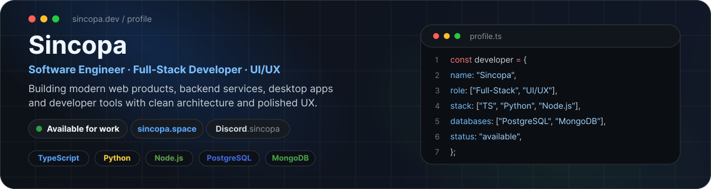

<div align="center">
  
</div>

<br>

<div align="center">

[](https://sincopa.space/)
[](https://discord.gg/4nErD5gZZA)

<br>


</div>

---

## ✦ About me

```yaml
developer:
  name: Sincopa

  roles:
    - Software Engineer
    - Full-Stack Developer
    - UI/UX Developer

  focus:
    - Web applications
    - Backend services & APIs
    - Desktop software
    - Developer tooling
    - Databases & integrations

  also_working_with:
    - Game systems
    - Garry's Mod / GLua

  currently:
    building: "useful products with polished interfaces"
    status: "available for freelance work"
```

---

## 🧩 What I do

<table>
<tr>
<td width="33%" valign="top">

### 🌐 Web & Frontend
Modern, responsive applications built with **Svelte, React and TypeScript**, with attention to UX, performance and maintainability.

</td>
<td width="33%" valign="top">

### ⚙️ Backend & Data
APIs, application logic, integrations and data layers with **Node.js, Python, PostgreSQL, MongoDB and SQL**.

</td>
<td width="33%" valign="top">

### 🖥️ Desktop & Systems
Desktop software, utilities and developer tools with **Tauri, Electron and WebUI technologies**, plus game-related systems when a project calls for them.

</td>
</tr>
</table>

---

## ⚡ Tech stack

### Languages


### Frontend


### Backend & Runtime


### Databases


### Desktop & Tools


---

## 🚀 Featured work

<table>
<tr>
<td width="50%" valign="top">

### Netch

A Windows proxy client with **per-application routing**, VLESS / REALITY support and multiple networking modes.

**Areas:** `Networking` `Desktop` `Proxy` `Developer Tools`

[](https://github.com/Sincopa/netch)

</td>
<td width="50%" valign="top">

### Boro Trading System

A polished trading system for Garry's Mod focused on clean UX, networking and inventory integrations.

**Stack:** `GLua` `Networking` `Databases` `UI`

[](https://www.gmodstore.com/market/view/boro-trading-system)

</td>
</tr>
</table>

---

## 📊 GitHub activity

<div align="center">


<br>


</div>

---

## 💬 Have a project in mind?

<div align="center">

I'm open to **web applications, backend services, desktop software, developer tools, UI/UX and custom development**.

Game development and **Garry's Mod / GLua** are part of my experience, but not the only area I work in.

### [sincopa.space](https://sincopa.space/) · [Discord: .sincopa](https://discord.gg/4nErD5gZZA)

<br>

<sub>Build things people actually enjoy using.</sub>

</div>
